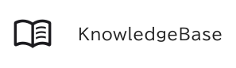
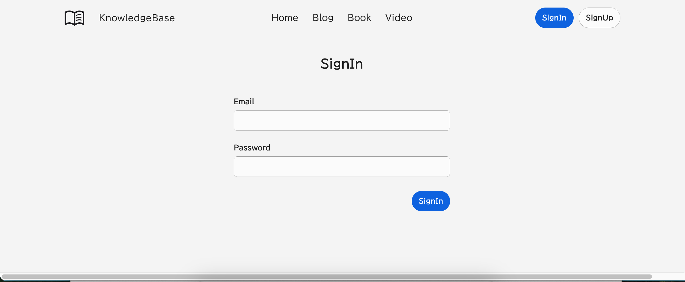
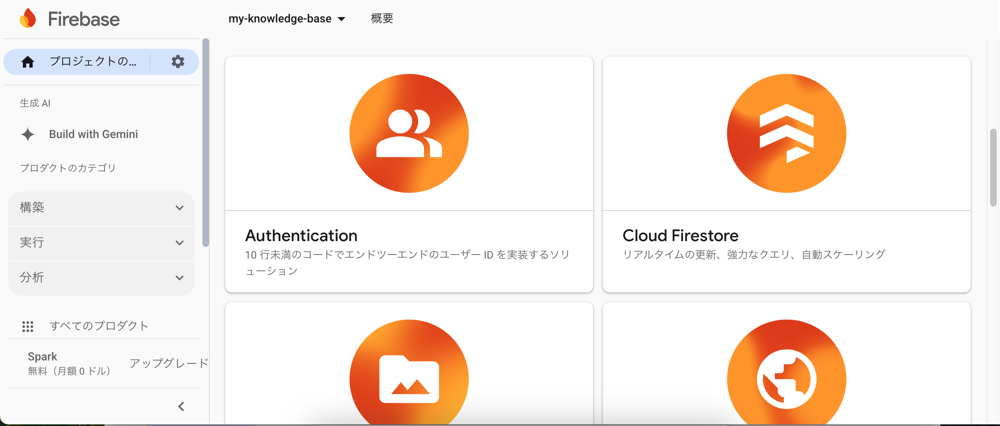
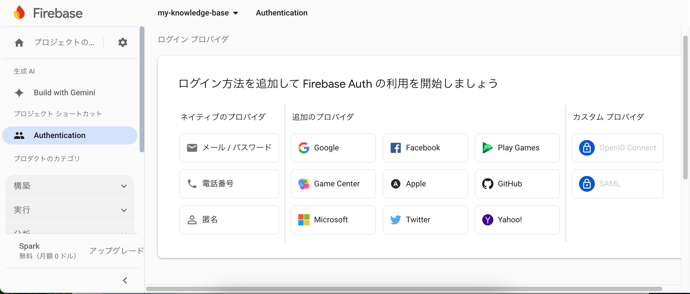
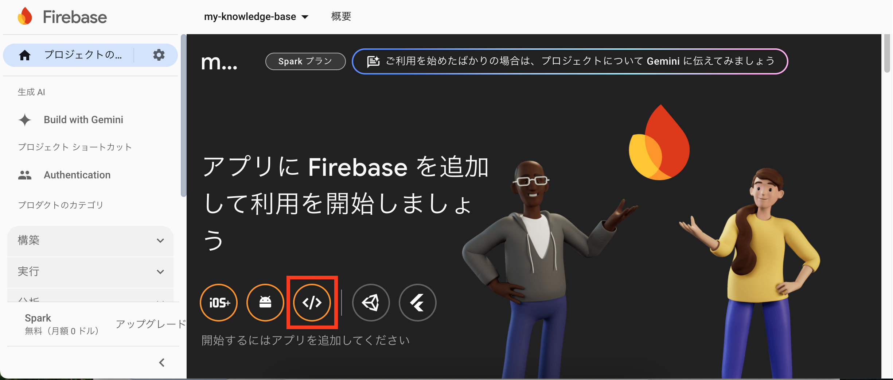
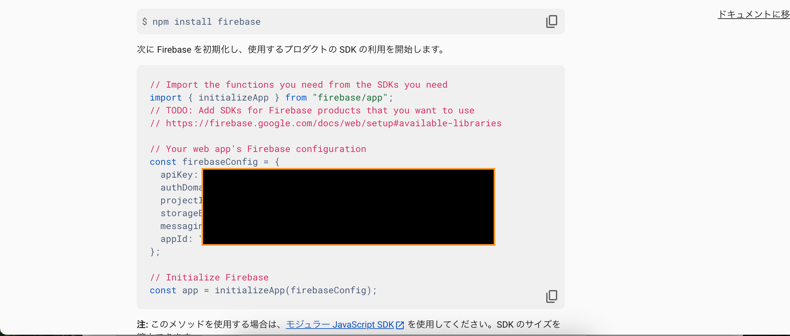

<p align="center">
    
</p>

## 概要
自分がこれまで学習してきた教材を記録しておくナレッジベースです。  
Blog、Book、Video という3ジャンルにおいて学習教材を記録することができます。

## 画面


## 初期設定
### firebaseのプロジェクト作成
https://console.firebase.google.com/u/1/ にアクセスして新しいプロジェクトを作成します。  
作成した後は、以下の画像に示されている "Authentication" の箇所をクリックします。

その後以下の画面まで辿り着いたら、認証方法として "メール/パスワード" の部分をクリックします。

続いて、React側との接続を行うためのクレデンシャルを取得します。  
プロジェクトのトップページとして以下のような画面に辿り着いたら、赤枠で囲んでいる箇所をクリックして、webアプリのアプリとの接続を開始します。

遷移先のページにてアプリの名称などを入力して先に進むと、以下のような画面が現れます。
この画面にて、ちょうど黒塗りしている部分にクレデンシャルが表示されているのでコピーします。


### 環境変数の設定
以下のコマンドで、既存の```.env_template```をコピーして、```.env```を作成します。
``` bash
cp ./my-app-ts/.env_template ./my-app-ts/.env
```
作成後は、一つ前の段階で作成したfirebaseのクレデンシャルを入力します。  
```.env```にはfirebaseのクレデンシャルの他に、以下のようにバックエンドのエンドポイントが設定されています。
```bash
REACT_APP_ENDPOINT="http:://localhost:8080"
```
初期設定では、バックエンドのエンドポイントがlocalhostとなっているので、状況に応じてこちらを変更してください。

### nodeのインストール
https://nodejs.org/ja/ のサイトの指示に従ってNode.jsをインストールします。

### パッケージのインストール
以下のコマンドに従って、必要なパッケージをインストールします。
```bash
cd ./my-app-ts
npm install
```

## 立ち上げ
以下のコマンドでフロントエンドを立ち上げることができます。
```bash
npm start
```
